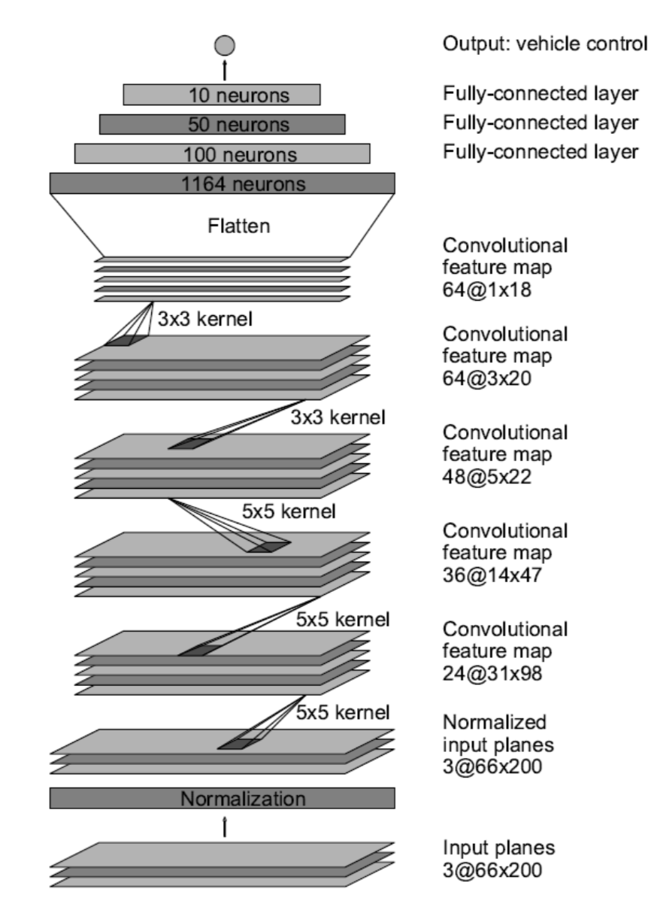
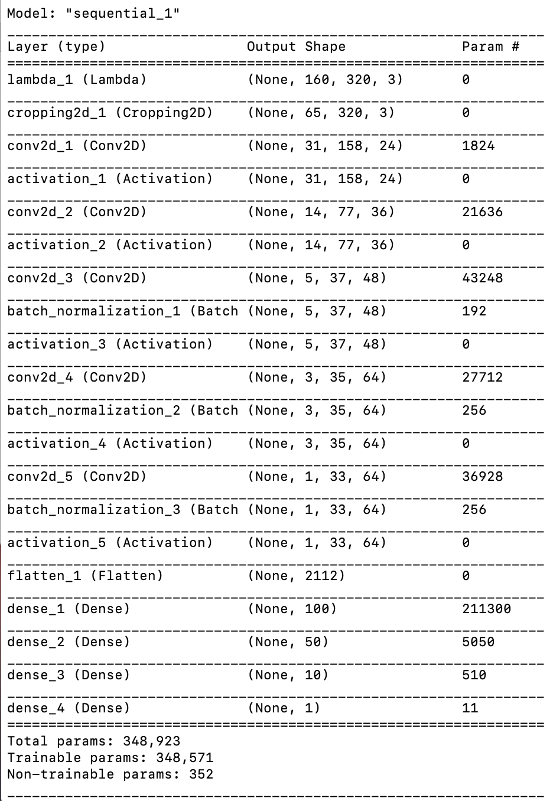
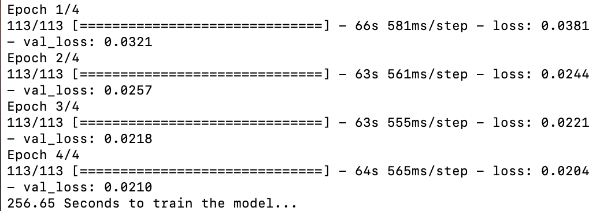

# P3-Behaviroal Cloning

## Overview

In this project for the Udacity Self-Driving Car Nanodegree a deep CNN is developed that can steer a car in a simulator provided by Udacity. The CNN drives the car autonomously around a track. The network is trained on images from a video stream that was recorded while a human was steering the car. The CNN thus clones the human driving behavior.


The goals / steps of this project are the following:

* Use the simulator to collect data of good driving behavior 
* Design, train and validate a model that predicts a steering angle from image data
* Use the model to drive the vehicle autonomously around the first track in the simulator. The vehicle should remain on the road for an entire loop around the track.
* Summarize the results with a written report


## Project Structure

The project includes the following files:

- [drive.py](./drive.py) for driving the car in autonomous mode and save the model (no need to modify)
- [video.py](./video.py) for creating a video based on images recorded from the car simulator
- [model.py](./model.py) for containing the script to create and train the model
- [model.h5](./model.h5) for containing the trained Keras(CNN) model
- [utils.py](./utils.py) for containing all the preprocessing functions, including image processing, augmentation, and batch generator

- [run1.mp4](./run1.mp4) for recording the vehicle driving autonomously around the track for at least one full lap
- [README.md](./README.md) for describing how to create the model and output the video


Additionally, it is recommended to download the [car simulator](https://github.com/udacity/self-driving-car-sim) provide by Udacity to run and test the performance of the model.


## General Info

### Dependencies

This project requires Python3 and the following libraries installed:

- NumPy
- Scikit -Learn
- Tensorflow
- Keras
- OpenCV
- Jupyter(optional)
- Matplotlib(optional)


### How to Run the Model

- #### Make hands `clean`

In this way, the model can be run directly with the simulator and existing model weights saved as `model.h5`, using the following command:

```python
python drive.py model.h5
```

Then, the car can be driven autonomously around the track in the simulator.

- #### Make hands `dirty`

In this way, the model can be restarted from the training.

To train the model, the training data can be collected from the simulator in `training mode` by driving the car manually around the track at least one round and then stored in `./data`.

(Also, you can skip this step and use the provided data stored in `data.zip`.)

Next, the trained model can be saved as `model.h5` using the following command:

```python
python model.py
```

Once the model has been saved, the simulator can be started in `autonumous mode`, with `drive.py` being used to monitor the performance in the following command:

```python
python drive.py model.h5
```

By the way, if you would like to record the result in a video yourself, please type:

```python
python drive.py model.h5 run1
```

`run1` is the directory in which the images monitored by the agent are saved. (If the directory already exists, it will be overwritten)

After that, a video based on images in `run1` directory can be created with `video.py` using the following command:

```python
python video.py run1
```

The name of the video will be the name of the directory followed by `'.mp4'`. In this case the video will be `run1.mp4`.

### Why create a video

1. It's been noted the simulator might perform differently based on the hardware. So if your model drives succesfully on your machine it might not on another machine (your reviewer). Saving a video is a solid backup in case this happens.
2. You could slightly alter the code in `drive.py` and/or `video.py` to create a video of what your model sees after the image is processed (may be helpful for debugging).


## Implementation

### 1.Data Collection

Before the training, the simulater captures data with a frequency of 10HZ. In a single timestap, three images taken from left, centre, and right cameras were collected as shown below:

|           Left            |            Center             |            Right            |
| :-----------------------: | :---------------------------: | :-------------------------: |
|  |  |  |

The collected data consists of 24108 images (8036 images per camera angle) which were preprocessed including image processing and augmentation before being fed into the CNN.

### 2.Data Preprocessing

- Random choice of cameras

  ```python
  # Load image randomly（left / middle / right）
  # Add the steering angle by +0.2/-0.2 for left/right image respectively
  def random_img_choose(sample):
      choice = np.random.choice(3, 1)
      if choice == 0:
          name = './data/IMG/' + sample[0].split('/')[-1]
          center_image = cv2.imread(name)
          center_image = cv2.cvtColor(center_image, cv2.COLOR_BGR2RGB)
          center_angle = float(sample[3])
      elif choice == 1:
          name = './data/IMG/' + sample[1].split('/')[-1]
          center_image = cv2.imread(name)
          center_image = cv2.cvtColor(center_image, cv2.COLOR_BGR2RGB)
          center_angle = float(sample[3]) + 0.2
      else:
          name = './data/IMG/' + sample[2].split('/')[-1]
          center_image = cv2.imread(name)
          center_image = cv2.cvtColor(center_image, cv2.COLOR_BGR2RGB)
          center_angle = float(sample[3]) - 0.2
      return center_image, center_angle
  ```

- Random flip

  ```python
  # Flip the image randomly in horizontal direction
  def random_img_flip(img, angle):
      rand = np.random.rand()
      if rand > 0.5:
          # 1:    horizontal flip
          # 0:    vertical flip 
          # -1:   horizontal & vertical flip
          img = cv2.flip(img, 1)
          angle = -angle
      return img, angle
  ```

- Random shadow

  ```python
  # Add some shadow to the image randomly
  def random_shadow(image):
      # (x1, y1) and (x2, y2) forms a line
      # xm, ym gives all the locations of the image
      x1, y1 = IMAGE_WIDTH * np.random.rand(), 0
      x2, y2 = IMAGE_WIDTH * np.random.rand(), IMAGE_HEIGHT
      xm, ym = np.mgrid[0:IMAGE_HEIGHT, 0:IMAGE_WIDTH]
  
      # mathematically speaking, we want to set 1 below the line and zero otherwise
      # Our coordinate is up side down.  So, the above the line:
      # (ym-y1)/(xm-x1) > (y2-y1)/(x2-x1)
      # as x2 == x1 causes zero-division problem, we'll write it in the below form:
      # (ym-y1)*(x2-x1) - (y2-y1)*(xm-x1) > 0
      mask = np.zeros_like(image[:, :, 1])
      mask[(ym - y1) * (x2 - x1) - (y2 - y1) * (xm - x1) > 0] = 1
  
      # choose which side should have shadow and adjust saturation
      cond = mask == np.random.randint(2)
      s_ratio = np.random.uniform(low=0.2, high=0.5)
  
      # adjust Saturation in HLS(Hue, Light, Saturation)
      hls = cv2.cvtColor(image, cv2.COLOR_RGB2HLS)
      hls[:, :, 1][cond] = hls[:, :, 1][cond] * s_ratio
      return cv2.cvtColor(hls, cv2.COLOR_HLS2RGB)
  ```

- Random brightness

  ```python
  # Ajust brightness of the image randomly
  def random_brightness(image):
      # HSV (Hue, Saturation, Value) is also called HSB ('B' for Brightness).
      hsv = cv2.cvtColor(image, cv2.COLOR_RGB2HSV)
      ratio = 1.0 + 0.4 * (np.random.rand() - 0.5)
      hsv[:,:,2] =  hsv[:,:,2] * ratio
      return cv2.cvtColor(hsv, cv2.COLOR_HSV2RGB)
  ```

### 3.Network Architecture

The CNN archtecture was inspired by NVIDA model, which was derived from End to End Learning for Self-Driving Cars paper shown as below:



Obviously, this model is more complitcated than that this project requires. The newly designed CNN, therefore, can be simplified by removing redundant fully connected layers and adding batch normalization in convolutional layers.


Keras can briefly create the model in good encoding as below:

```python
from keras.models import Sequential
from keras.layers import BatchNormalization
from keras.layers import Flatten, Dense, Activation, Conv2D, Cropping2D
from keras import backend as K
from keras.layers import Lambda

# Create the training model, based on NVIDA's model
def modeling():
    model = Sequential()
    model.add(Lambda(lambda x: x / 255.0 - 0.5, input_shape=INPUT_SHAPE))
    # crop the top 70 rows and bottom 25 rows
    model.add(Cropping2D(cropping=((70, 25), (0, 0))))
    model.add(Conv2D(filters=24, kernel_size=(5,5), strides=(2,2)))
    model.add(Activation('relu'))
    model.add(Conv2D(filters=36, kernel_size=(5,5), strides=(2,2)))
    model.add(Activation('relu'))
    model.add(Conv2D(filters=48, kernel_size=(5,5), strides=(2,2)))
    model.add(BatchNormalization())
    model.add(Activation('relu'))
    model.add(Conv2D(filters=64, kernel_size=(3,3)))
    model.add(BatchNormalization())
    model.add(Activation('relu'))
    model.add(Conv2D(filters=64, kernel_size=(3,3)))
    model.add(BatchNormalization())
    model.add(Activation('relu'))
    model.add(Flatten())
    # model.add(Dense(1164, activation='relu'))
    model.add(Dense(100, activation='relu'))
    model.add(Dense(50, activation='relu'))
    model.add(Dense(10, activation='relu'))
    model.add(Dense(1))

    model.summary()
    return model
```

The dense layer containing 1164 nerouns was removed and 3 batch normalization layers were added in last three convolutional layers. 


- **Note:**

`Batch Normalization` can:

1. Accelerate the training and improve the speed of convergence.
2. Avoid overfitting due to regularization which can even replacing `dropout`.

3. Lower the dependences of the initialization of weights and bias, which results in higher learning rates without risk of divergence.

### 4.Training

- Load data

```python
# Load data from driving_log.csv
def read_lines():
    samples = []
    with open('./data/driving_log.csv') as file:
        reader = csv.reader(file)
        for i, line in enumerate(reader):
            if i > 0:
                samples.append(line)
    return samples
```

- Generator to yield each single batch from training data

```python
# Define a generator to yield each single batch of the training data
# in order to save the memory of CPU 
def generator(samples, batch_size):
    shuffle(samples)
    num_samples = len(samples)
    while 1:    # Loop forever so the generator never terminates
        for offset in range(0, num_samples, batch_size):
            batch_samples = samples[offset: offset+batch_size]
            images = []
            angles = []
            for i, sample in enumerate(batch_samples):
                img, angle = random_img_choose(sample)
                img, angle = random_img_flip(img,angle)
                img = random_shadow(img)
                img = random_brightness(img)
                
                images.append(img)
                angles.append(angle)

            yield shuffle(np.array(images), np.array(angles))
```

- Training Step

```python
# Train the model
def training(model, train_generator, validation_generator):

    # record the training time
    t1=time.time()

    model.compile(loss='mse', optimizer='adam')
    history = model.fit_generator(generator=train_generator,
                    steps_per_epoch=len(train_samples)/BATCH_SIZE,
                    validation_data=validation_generator,
                    validation_steps=len(validation_samples)/BATCH_SIZE,
                    epochs=5, verbose=1)
    t2=time.time()
    print(round(t2-t1, 2), 'Seconds to train the model...')

    # plot the loss trend
    loss = history.history['loss']
    val_loss = history.history['val_loss']
    epochs = range(1, len(loss) + 1)
    plt.plot(epochs, loss, 'y', label='Training loss')
    plt.plot(epochs, val_loss, 'r', label='Validation loss')
    plt.title('Training and Validation loss')
    plt.xlabel('Epochs')
    plt.ylabel('Loss')
    plt.legend()
    plt.show()  
```

- Main Function

```python
if __name__ == '__main__':
		# load the training data    
    samples = read_lines()
    samples = shuffle(samples)

    # split samples into training and validation
    train_samples, validation_samples = train_test_split(samples, test_size=0.1)

    # create the training and validation generator
    train_generator = generator(train_samples, batch_size=BATCH_SIZE)
    validation_generator = generator(validation_samples, batch_size=BATCH_SIZE)

    # create the model
    model = modeling()

    # train the model
    training(model, train_generator, validation_generator)

    # save the trained model
    model.save('model.h5')
```


- HyperParameters

> IMAGE_HEIGHT, IMAGE_WIDTH, IMAGE_CHANNELS = 160, 320, 3
>
> INPUT_SHAPE = (IMAGE_HEIGHT, IMAGE_WIDTH, IMAGE_CHANNELS)
>
> BATCH_SIZE = 64
>
> EPOCH = 4

There are `348,923 params` in total during the training which costs `256.65 seconds` in `4 epochs`.







- Loss Trend


## Results

### Test

The model was tested in the simulator in `autonomous mode` using the following command:

```
python drive.py model.h5 run1
```

The driving frames are stored in [run1](./run1) directory.

### Video

The video can be generated using images in run1 directory by the following command:

```python
python video.py run1
```

The final result was saved as [video.mp4](./video.mp4). It looks like below:


## Conclusion

It is essential to pay highly attention to the data processing. Data augmentation was a great assist to improve the performance of the model that avoids overfitting. In this project, it took a lot of time in parameters tuning, including the choice of BATCH_SIZE(32/64), EPOCH(3/4/5), and the number of convolutional and dense layers. Thus, Parmeters tuning can be regraded as an experimental skill that not only makes hands dirty but also achieves a forward progress.


**Note**

Please keep in mind that training images are loaded in BGR colorspace using cv2 while drive.py load images in RGB to predict the steering angles. This is why my early trained models lacked of performance  and it was getting better after colorspace conversion from BGR to RGB using 

`cv2.cvtCOLOR(image, cv2.COLOR_BGR2RGB)`.